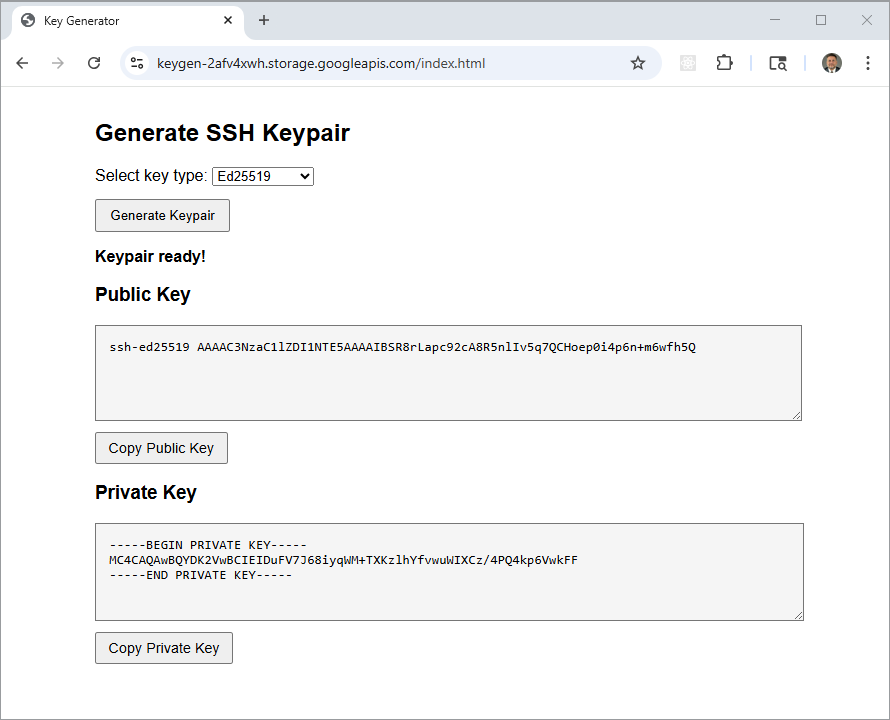
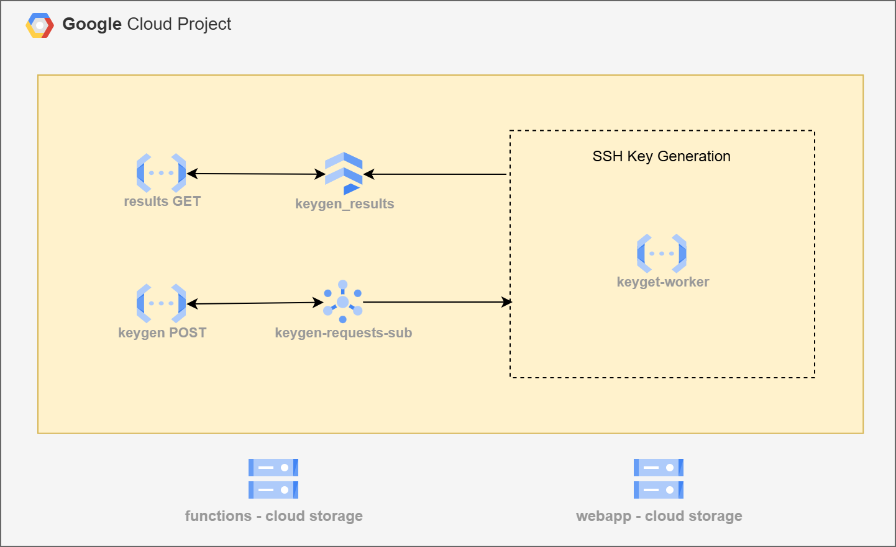
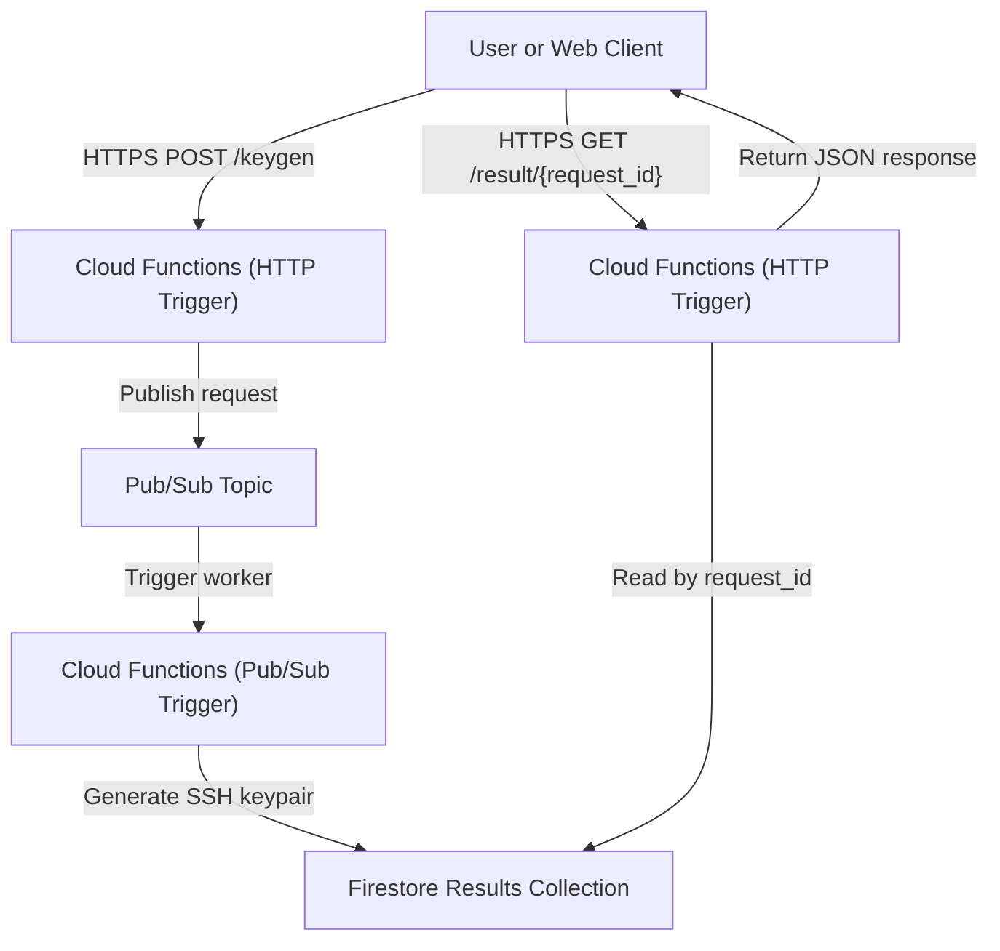

# GCP SSH KeyGen Microservice

This project delivers a fully automated **serverless SSH key generation service**
on **Google Cloud Platform (GCP)**, built using **Pub/Sub**, **Cloud Functions
(Python)**, **Cloud Firestore**, and **HTTP-triggered Cloud Function endpoints**.

It uses **Terraform** and **Python (google-cloud SDKs + cryptography)** to
implement a **message-driven, asynchronous key generation pipeline** that
processes SSH keypair requests without requiring any virtual machines or
long-running infrastructure.

Requests are submitted via an HTTP API, queued through Pub/Sub, processed by a
background Cloud Function, and written to Firestore for retrieval using a unique
`request_id`.

For testing this service, a simple HTML frontend lets users trigger key
generation requests directly from a browser using the deployed API endpoints.



This design follows a **stateless, event-driven microservice architecture**:
Functions scale automatically on demand, keys are generated entirely in memory,
and results expire automatically—ensuring low cost, strong isolation, and
minimal operational overhead.

Key capabilities demonstrated:

1. **Serverless Key Generation Pipeline** – Fully event-driven workflow using
   Pub/Sub, Cloud Functions, and Firestore.
2. **Asynchronous Processing Model** – Clients submit jobs via HTTP and poll for
   results using a correlation ID.
3. **Secure Key Handling** – SSH keypairs are generated in memory only and stored
   temporarily in Firestore, base64-encoded for safe transport.
4. **Infrastructure as Code (IaC)** – Terraform provisions Pub/Sub topics,
   Cloud Functions, Firestore, IAM roles, and supporting resources.
5. **Optional Static Web Client** – A lightweight HTML frontend hosted on Google
   Cloud Storage enables browser-based testing of the API endpoints.

Together, these components form a **cloud-native, serverless DevOps utility**
suitable for CI/CD pipelines, ephemeral environments, demos, or short-lived
development workflows.



## HTTP API Endpoints

The **KeyGen API** exposes two HTTP endpoints through **Google Cloud Functions
(HTTP-triggered)**, providing a simple request/response workflow for asynchronous
SSH key generation.  
All endpoints return structured JSON and are designed to integrate seamlessly
with both CLI tools and browser-based clients.

Internally, requests are published to **Google Cloud Pub/Sub**, processed by a
background worker Cloud Function, and persisted temporarily in **Cloud
Firestore**.

### POST /keygen

**Purpose:**  
Submits a new SSH key generation request to the service.  
The request is published to a Pub/Sub topic and processed asynchronously by a
Pub/Sub-triggered Cloud Function.

**Request Body (JSON):**
```json
{
  "key_type": "rsa",
  "key_bits": 2048
}
```

**Parameters:**
| Field | Type | Required | Description |
|-------|------|-----------|-------------|
| `key_type` | string | No | Type of key to generate (`rsa` or `ed25519`). Defaults to `rsa`. |
| `key_bits` | integer | No | RSA key size (`2048` or `4096`). Ignored for Ed25519 keys. |

**Example Request:**
```bash
curl -X POST https://<cloud-function-url>/keygen \
  -H "Content-Type: application/json" \
  -d '{"key_type": "rsa", "key_bits": 2048}'
```

**Example Response:**
```json
{
  "request_id": "630f70c4-815c-41d1-ae52-6babf3a41b1f",
  "status": "submitted"
}
```

**Behavior:**
- The API immediately returns a unique `request_id` for correlation.  
- The actual key generation occurs asynchronously in a Pub/Sub-triggered worker.  
- Clients must poll the `/result/{request_id}` endpoint to retrieve results.

### GET /result/{request_id}

**Purpose:**  
Retrieves the result of a previously submitted SSH key generation request.

**Path Parameters:**
| Parameter | Type | Description |
|------------|------|-------------|
| `request_id` | string | Unique ID returned by the `/keygen` call. |

**Example Request:**
```bash
curl https://<cloud-function-url>/result/630f70c4-815c-41d1-ae52-6babf3a41b1f
```

**Example Response (Pending):**
```json
{
  "request_id": "630f70c4-815c-41d1-ae52-6babf3a41b1f",
  "status": "pending"
}
```

**Example Response (Completed):**
```json
{
  "request_id": "630f70c4-815c-41d1-ae52-6babf3a41b1f",
  "status": "complete",
  "key_type": "rsa",
  "key_bits": 2048,
  "public_key_b64": "LS0tLS1CRUdJTiBSU0EgUFVCTElDIEtFWS0tLS0t...",
  "private_key_b64": "LS0tLS1CRUdJTiBSU0EgUFJJVkFURSBLRVktLS0tLQo..."
}
```

**Status Values:**
| Status | Description |
|---------|--------------|
| `submitted` | Request accepted and published to Pub/Sub. |
| `pending` | Request is being processed by the worker function. |
| `complete` | Key generation successful; keypair included in response. |
| `error` | Request failed; additional error message provided. |

---

**Notes:**
- Responses are served by Cloud Functions backed by Firestore lookups.  
- SSH keys are generated entirely in memory and stored temporarily,
  base64-encoded.  
- Firestore TTL automatically expires results, ensuring security and cost
  control.

### Architecture Flow



## Prerequisites

* [A Google Cloud Account](https://console.cloud.google.com/)
* [Install gcloud CLI](https://cloud.google.com/sdk/docs/install) 
* [Install Terraform](https://developer.hashicorp.com/terraform/install)

If this is your first time watching our content, we recommend starting with this video: [GCP + Terraform: Easy Setup](https://youtu.be/3spJpYX4f7I). It provides a step-by-step guide to properly configure Terraform, Packer, and the gcloud CLI.